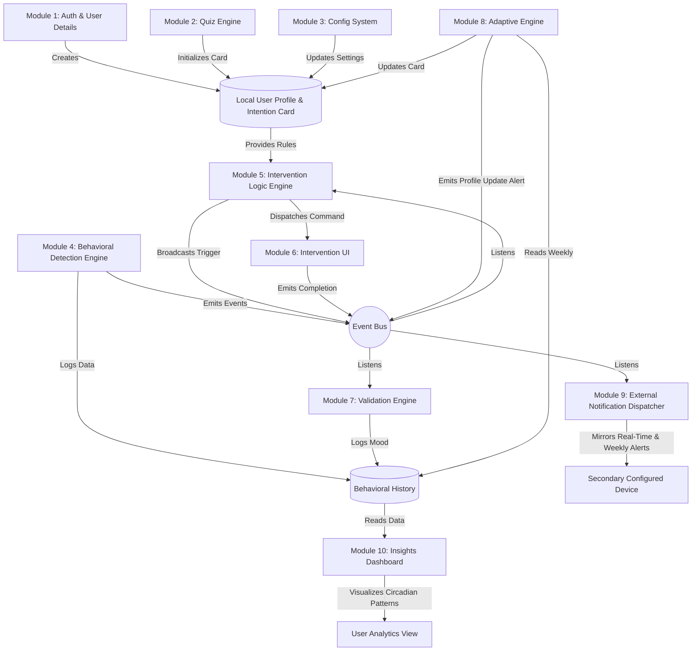

# ScreenBalance: Modular Feature Breakdown

Based on the overall objective, the ScreenBalance app can be architected into distinct, independent modules. By using an **Event-Driven Architecture** (where modules communicate via an event bus or generic state manager), we ensure that no single feature is tightly coupled or directly dependent on another.

---

## 1. User Identity & Profile Management (New)
**Responsibility:** Handles local user login, profile creation, and stores user details securely on the device.
*   **Inputs:** User credentials/login details.
*   **Outputs:** A local `UserProfile` object which includes demographic info, settings, and the currently active **Intention Card**.
*   **Independence:** Can be replaced with a cloud auth system later without affecting the rest of the app. It solely acts as the source of truth for "Who is using this app?".
*   **Research Basis:** Privacy-first, local-only processing builds trust. Research indicates that users are highly resistant to behavioral interventions if they feel their personal data is externally surveilled. [(NIH — Digital Health Privacy, 2024)](https://pubmed.ncbi.nlm.nih.gov)

## 2. Quiz & Initial Calibration Engine
**Responsibility:** Administers the 1-minute personal awareness quiz and calculates the user's initial psychological baseline.
*   **Inputs:** User responses to the following 10 psychology-mapped questions:
    1. "When you pick up your phone, how often do you know exactly why you unlocked it?"
    2. "How soon after waking up do you usually check social media, news, or emails?"
    3. "Do you find yourself endlessly scrolling in bed, knowing you should be sleeping?"
    4. "Around 2-3 PM, do you reach for short-form video to fight off a drop in energy?"
    5. "If you face a difficult or boring task, does your app-switching suddenly increase?"
    6. "How often do you unlock your phone in an elevator or line, purely out of muscle memory?"
    7. "When a notification pops up, how hard is it for you to ignore it and keep working?"
    8. "Do you ever read negative news or endless feeds until you feel tense or 'zoned out'?"
    9. "After using specific apps, do you frequently feel drained, envious, or 'less than'?"
    10. "If we could help you reclaim one thing, would you choose 'More Focus', 'Better Sleep', or 'Less Anxiety'?"
*   **Outputs:** Generates the initial **Intention Zone Profile Card** and attaches it to the `UserProfile`. Possible profiles include:
    *   🌅 **The Morning Scroller** (Reactive Start)
    *   🌙 **The Evening Escapist** (Revenge Bedtime Procrastination)
    *   ☕ **The Midday Slumper** (Circadian Energy Crash)
    *   🏃 **The Task Avoidant** (Avoidance Coping)
    *   👻 **The Phantom Checker** (Unconscious Habit Loop)
    *   🔔 **The Notification Reactive** (Stimulus Reactivity)
    *   🌀 **The Doomscroller** (Anxiety-Seeking)
    *   ⚖️ **The Social Comparer** (Emotional Dysregulation & FOMO)
*   **Independence:** This module is purely an assessment tool used during onboarding. It takes inputs and produces an initial profile score.
*   **Research Basis:** Anxiety often *precedes* compulsive phone use as a coping mechanism. Mapping the emotional root cause via a quiz is more effective than setting generic time limits. [(NIH — Bidirectional Hypothesis, 2024)](https://pubmed.ncbi.nlm.nih.gov)

## 3. Configuration & Boundary Management System
**Responsibility:** Provides the UI and storage mechanism for the user to set their boundaries.
*   **Inputs:** User preferences (e.g., assigning apps to categories, configuring schedules, accountability contacts).
*   **Outputs:** A configuration ruleset containing:
    *   **Smart App Categorization:** 
        *   🔵 **Utility** (Exempt) e.g., Maps, Calculator, Bank
        *   🟡 **Social** (Disengage - 15 min) e.g., WhatsApp, Discord
        *   🔴 **Emotional Distraction** (Block) e.g., TikTok, Instagram Reels
        *   🟢 **Productivity** (Monitor only) e.g., Notion, Slack
        *   ⚪ **Entertainment** (Disengage - 30 min) e.g., Spotify, YouTube
    *   **Contextual Schedules:** User-defined *Target Bedtime* (for the staged sunset), *Focus Mode Hours*, and *Morning Buffer*.
*   **Independence:** A standard CRUD settings module. It manages state independently of how that state is enforced.
*   **Research Basis:** Setting predefined boundaries while the user is in a "cold" (rational) state is scientifically proven to reduce behavioral failures when they enter a "hot" (impulsive) state later. [(Psychology Today, 2024)](https://www.psychologytoday.com)

## 4. Behavioral Tracking & Detection Engine (Background Service)
**Responsibility:** Interacts with OS-level APIs (Screen Time, Accessibility Services) to monitor raw usage metrics.
*   **Inputs:** OS device events (app opens, lock/unlocks, scroll speed).
*   **Outputs:** Emits specific behavioral events to the Event Bus when threshold patterns are detected. The engine scans for the following triggers:

| Theme | Scenario | Behavioral Trigger (Detection Threshold) |
| :--- | :--- | :--- |
| **FOCUS** | **Dopamine Loop** | 3+ apps in <60 seconds. |
| **FOCUS** | **The Void** | 20+ mins of continuous scrolling. |
| **FOCUS** | **Reactive Mode** | 5+ notification-driven opens in 10 mins. |
| **SOCIAL** | **Social Spiral** | 10+ rapid profile views on Social apps. |
| **SOCIAL** | **Ghosting Anxiety**| Typing >100 chars, deleting all, and closing. |
| **SOCIAL** | **Upward Comparison Risk** | Prolonged passive scrolling on Image/Video Social apps (high dwell, low interaction). |
| **REST** | **Midnight Drift** | Usage 1 hour past Sleep Goal. |
| **REST** | **Last Scroll Loop**| 3+ Lock/Unlock cycles in <2 mins at night. |
| **REST** | **Work-Life Blur** | Opening Slack/Email during 'Digital Sunset'. |
| **NOVELTY** | **Phantom Check** | 10+ unlocks in 15 mins (no pings). |
| **NOVELTY** | **Novelty Hunt** | 5+ Shopping/Store apps in 10 mins. |
| **STRESS** | **Info Overload** | 5+ news/high-intensity apps in 15 mins. |
| **STRESS** | **Interaction Spike**| Rapid scrolling speed (px/sec) doubling. |

*   **Independence:** A "dumb" sensor that only observes and broadcasts raw behavioral metrics without knowing why.
*   **Research Basis:** Problematic smartphone use is defined by *compulsive, uncontrolled behavior* (like rapid switching), not total screen time duration. [(Psychology Today Meta-Analysis, 2024)](https://www.psychologytoday.com). Additionally, passive social media consumption drives FOMO, leading to upward comparison and self-esteem decline. [(Frontiers in Psychology, 2024)](https://www.frontiersin.org)

## 5. Intervention Logic & Routing Engine
**Responsibility:** Acts as the "Brain" or rules engine. It listens to events from the Detection Engine, checks the user's Profile and Configuration, and decides if an action is needed.
*   **Inputs:** Subscribes to events from the Detection Engine. Reads the `UserProfile` and **Configuration Ruleset**.
*   **Contextual Override Evaluation:** Before routing standard notifications, it applies time-based and override rules:
    *   **Focus Mode Hours:** Applies stricter tracking rules during deep work windows.
    *   **Staged Digital Sunset:** Evaluates time relative to user's Target Bedtime (T-0):
        *   *T-90 min:* Blocks "Emotional Distraction" apps.
        *   *T-60 min:* Blocks high-intensity content; applies OS-level Grayscale to "Social" apps.
        *   *T-30 min:* Only "Utility" apps available; enforces full Dark Mode.
        *   *T-0 (Bedtime):* Enforces screen lock and suggests optional soundscape.
    *   **Morning Mindfulness Buffer:** Enforces a 30-min block on all "Social" apps after the first morning unlock, and routes a daily intention micro-prompt instead.
    *   **One-Time Override:** Listens for a success signal from Module 6 (Somatic Reset) to temporarily bypass any block.
*   **Outputs:** Dispatches a trigger command to launch a specific intervention which is broadcasted to the Event Bus. It attaches contextual, compassionate messages to these triggers:

| Scenario | Suggested Notification Message | Routed Somatic/CBT Intervention |
| :--- | :--- | :--- |
| **Dopamine Loop** | "You're moving fast between apps. This rapid switching can fragment your focus. Ready for a quick reset?" | **The Sky Reset:** Step outside (or near a window), tilt your face toward the sky, and close your eyes for 60 seconds. |
| **The Void** | "You've been scrolling for a while. This can create a 'mental fog.' Let's pull your awareness back to the room." | **The 5-Object Scan:** Look away from the screen and find 5 objects in the room that are the same color. |
| **Reactive Mode** | "You're reacting to pings as they come. This high-alert mode increases cognitive load. Want to take back control?" | **The Horizon View:** Stand up and look at the furthest point you can see out a window for 60 seconds to reset your visual system. |
| **Social Spiral** | "You're looking at a lot of social profiles. This can sometimes trigger subconscious comparison stress. Shall we ground ourselves?" | **The Heart-Hand Grounding:** Place one hand on your heart and one on your belly. Feel your own breath for 30 seconds. |
| **Ghosting Anxiety**| "It looks like you're hesitating on a message. Overthinking can build social tension. Let's take a breath before deciding." | **The 4-7-8 Breath:** Inhale for 4s, hold for 7s, exhale for 8s to calm the nervous system. |
| **Upward Comparison Risk** | "Notice how this content is making you feel. Can we reframe this comparison into curiosity?" | **Social Savoring Reframe:** A micro-prompt exercise to actively shift from FOMO to positive appreciation. |
| **Midnight Drift** | "It's past your quiet hour. Late-night light can trick your brain into staying 'alert' when it needs rest." | **Tactile Grounding:** Put your phone down and touch 3 different textures (e.g., a cold table, a soft pillow, your own palms). |
| **Last Scroll Loop**| "You're trying to put the phone away, but the pull is strong. This 'last scroll' loop delays deep rest." | **The Darkroom Reset:** Put the phone in a drawer, turn off the lights, and sit in silence for 60 seconds. |
| **Work-Life Blur** | "Checking work apps now can prevent your brain from fully decompressing. Is this urgent, or can it wait for 'Future You'?" | **The Physical Boundary:** Walk to a different room or stand up and do a full-body stretch to mark the end of 'work mode.' |
| **Phantom Check** | "You've checked in 10 times with no alerts. This 'phantom checking' keeps your mind on high-alert." | **Somatic Release:** Roll your shoulders back 5 times and take one slow, deep breath with your eyes closed. |
| **Novelty Hunt** | "You're searching for something new. This 'novelty hunt' can be a sign of underlying restlessness." | **The Sensory Swap:** Find a physical object near you (a pen, a stone, a glass) and notice its weight and temperature for 60 seconds. |
| **Info Overload** | "You're processing a lot of high-intensity info. This can trigger a 'threat detection' state. Let's find some calm." | **The Cold Reset:** Splash some cold water on your face or hold a cold object for 30 seconds to calm the Vagus nerve. |
| **Interaction Spike**| "Your scrolling speed has increased. This often happens when the nervous system is revving up. Ready to slow down?" | **The Weighted Reset:** Sit down and press your feet firmly into the floor, feeling the support of the ground for 60 seconds. |

*   **Independence:** Contains only conditional logic mapping events to the correct empathetic message and reset command.
*   **Research Basis:** Staged Digital Sunsets are effective because cognitive stimulation from content (not just blue light) is the primary driver of sleep delay. [(Time / NIH, 2024)](https://time.com). Morning Buffers are vital because waking up immediately to social media amplifies existential anxiety. [(The Guardian, 2024)](https://www.theguardian.com)

## 6. Somatic & CBT Intervention Library (UI)
**Responsibility:** The immersive UI that delivers the actual interventions.
*   **Inputs:** Receives a command with a specific intervention ID.
*   **Outputs:** Emits an event upon completion (e.g., `EVENT_INTERVENTION_COMPLETED`).
*   **Independence:** A pure presentation module.
*   **Research Basis:** Somatic breathing interventions physically reduce cortisol by up to 23% and rapidly activate the parasympathetic nervous system via the vagus nerve. [(NIH — Diaphragmatic Breathing, 2024)](https://pubmed.ncbi.nlm.nih.gov)

## 7. Post-Intervention Validation Engine
**Responsibility:** Handles the visual mood check (Entropy Images) or provides motivational support after an intervention.
*   **Inputs:** Triggered by an `EVENT_INTERVENTION_COMPLETED` signal.
*   **Outputs:** Records the validation result to local analytics.
*   **Independence:** A standalone micro-flow.
*   **Research Basis:** Non-verbal projective selection (like choosing an image based on entropy) bypasses cognitive bias, preventing the user from just giving the "correct" answer when assessing their regulated state. [(Psychology Today, 2024)](https://www.psychologytoday.com)

## 8. Adaptive Behavior Engine (The Weekly Updater)
**Responsibility:** Observes the user's actual behavior over a 7-day period and adapts their Intention Card dynamically if their behavior diverges from their initial quiz answers.
*   **Inputs:** Historical data from the Tracking Engine over the last week.
*   **Outputs:** Updates the `UserProfile`'s Intention Card (e.g., transitioning from "The Morning Scroller" to "The Doomscroller" based on actual data) and **emits an alert to notify BOTH the primary user and the configured secondary user(s) of this behavioral shift**.
*   **Independence:** Runs on a scheduled background cron job. It operates completely independently of the real-time intervention logic.
*   **Research Basis:** Self-reporting is often inaccurate. Dynamically adapting the intervention baseline based on actual telemetry ensures the user receives relevant care without feeling judged. [(NIH — Destigmatization Research, 2024)](https://pubmed.ncbi.nlm.nih.gov)

## 9. External Notification & Accountability Dispatcher
**Responsibility:** Mirrors real-time alerts and sends behavioral summaries/updates to a user-configured secondary mobile device (e.g., an accountability partner).
*   **Inputs:** Listens to the Event Bus for high-level triggers (e.g., `EVENT_INTERVENTION_TRIGGERED`, `EVENT_PROFILE_UPDATED`, `EVENT_WEEKLY_SUMMARY`).
*   **Outputs:** **Instantly dispatches a mirrored notification** (via Push, SMS, or Cloud Sync) to the configured secondary user whenever the primary user receives an intervention trigger or a weekly profile update, keeping them fully in the loop in real-time.
*   **Independence:** A separate observer module. The core app functions perfectly whether this is enabled or disabled.
*   **Research Basis:** Social accountability and mirroring significantly increase adherence to habit-breaking protocols by introducing a supportive external observer. [(Harvard Health, 2024)](https://www.health.harvard.edu)

## 10. Insights & Awareness Dashboard (Analytics UI) (New)
**Responsibility:** Aggregates raw behavioral history into meaningful, user-facing insights, specifically serving the **Circadian Pattern Dashboard** and other tracking visualizers.
*   **Inputs:** Queries the `Behavioral History` datastore for historical events (e.g., morning first-unlock times, "Last Scroll" events, late-night usage).
*   **Outputs:** Renders visual data to the user:
    *   Average sleep/wake times.
    *   Frequency of "Last Scroll Loop" triggers.
    *   Weekly sleep quality trend scores.
*   **Independence:** A read-only presentation layer. It does not affect app logic or interventions; it merely visualizes the data already collected by Module 4 and the Event Bus.
*   **Research Basis:** Providing compassionate, non-judgmental data visualizations helps users objectively reframe their habits, moving them from a state of shame to a state of actionable self-awareness. [(PsyPost, 2026)](https://www.psypost.org)

---

## Architectural Diagram (Decoupled Flow)

